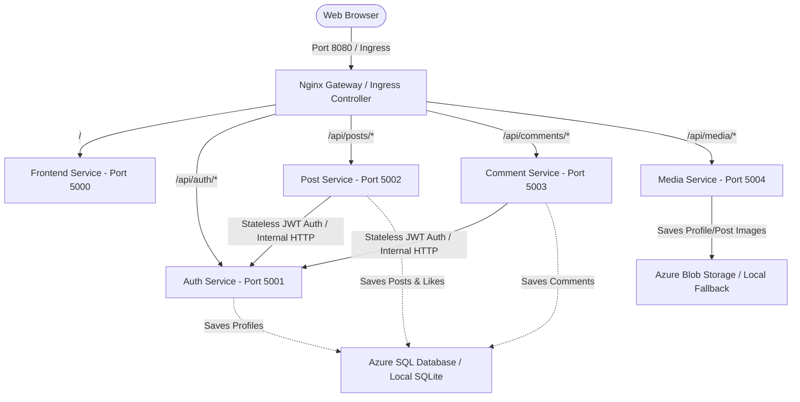

# SocialLite - Cloud-Native Social Media Microservices

Welcome to **SocialLite**! This is a realistic, cloud-native social media microservices ecosystem designed specifically as an **educational sandbox** for learning:
* **Docker** & Multi-container builds
* **Kubernetes** orchestration, services, configmaps, secrets, and ingress routing
* **CI/CD** pipelines using GitHub Actions
* **Cloud Integrations** with Azure SQL Database and Azure Blob Storage

---

## 🏗️ Architecture Overview

The system consists of **5 independent microservices** communicating via internal DNS and statelessly validating JSON Web Tokens (JWT):



### 💡 Core Architectural Highlights:
1. **Zero-Configuration Fallbacks:** Out-of-the-box, each microservice automatically detects if Azure connection strings are missing and gracefully falls back to local persistent SQLite databases and local filesystem directories. You can start the entire app with **zero setups**!
2. **Kubernetes-Mirrored Gateway:** A lightweight Nginx gateway in Docker Compose matches the path routing rules of a Kubernetes Ingress Controller. Because of this, the frontend JavaScript code makes requests to relative paths (e.g. `/api/auth/register`) rather than absolute port-specific URLs, allowing the identical code to run in both Docker Compose and Kubernetes!
3. **Internal Kubernetes DNS:** The `post-service` and `comment-service` utilize Kubernetes internal CoreDNS (e.g. `http://auth-service`) to dynamically fetch user profiles behind standard HTTP port `80`, showcasing ClusterIP service-to-service mapping!

---

## 📁 Directory Structure

```text
social-media-microservices/
├── auth-service/         # User auth, login, profile storage & JWT hashing
├── post-service/         # Post creations, feeds, deleting & liking
├── comment-service/      # Comments handling
├── media-service/        # Image uploading via Azure Blob Storage / Local Disk
├── frontend/             # Elegant, glassmorphic Bootstrap 5 + JS timeline UI
├── gateway/              # Nginx gateway mimicking Ingress locally
├── kubernetes/           # YAML Manifests (Deployments, Services, ConfigMaps, Ingress)
├── .github/workflows/    # CI/CD action pipeline
├── docker-compose.yml    # Single-command local startup orchestrator
└── README.md             # This pedagogical guide
```

---

## 🐳 1. Local Testing with Docker Compose

To build and start all microservices, persistent database volumes, and the API gateway locally with a single command:

```bash
# Build and spin up the containers
docker-compose up --build
```

### 🔍 Verifying the Services:
* **Frontend Web App:** Open `http://localhost:8080` in your web browser. You will be greeted by the elegant login screen!
* **Health Check Endpoints:**
  * Gateway: `http://localhost:8080/health` (Forwards to Frontend Health)
  * Auth Service: `http://localhost:8080/api/auth/health`
  * Post Service: `http://localhost:8080/api/posts/health`
  * Comment Service: `http://localhost:8080/api/comments/health`
  * Media Service: `http://localhost:8080/api/media/health`

### 🧪 What to test:
1. Go to the register page and sign up. Select a profile avatar to verify the **Media Service** successfully uploads to local storage and the **Auth Service** creates your user.
2. Log in. Your JWT token will be saved in your browser's local storage.
3. Write a post with an image and click **Share Post**.
4. **Like** the post and watch the counter increment in real-time.
5. Expand the comment drawer, submit a comment, and view the list of comments!

---

## ☸️ 2. Deploying on Kubernetes

Deploying SocialLite on Kubernetes simulates a realistic production configuration. You can run this locally using **Minikube**, **Kind**, or **Docker Desktop Kubernetes**.

### Step 1: Enable Ingress Controller (Minikube example)
```bash
minikube addons enable ingress
```

### Step 2: Build Images inside Kubernetes Docker Daemon
If you are running Minikube, configure your shell to build images directly into Minikube's internal Docker registry to avoid pushing to DockerHub:
```bash
# Set environment variables to target minikube's docker daemon
eval $(minikube docker-env)

# Build the images so Kubernetes can locate them locally
docker build -t auth-service:latest ./auth-service
docker build -t post-service:latest ./post-service
docker build -t comment-service:latest ./comment-service
docker build -t media-service:latest ./media-service
docker build -t frontend:latest ./frontend
```

### Step 3: Apply the Manifests
```bash
# 1. Apply configuration mappings and secrets
kubectl apply -f kubernetes/configmap.yaml
kubectl apply -f kubernetes/secrets.yaml

# 2. Apply internal ClusterIP services
kubectl apply -f kubernetes/services.yaml

# 3. Apply all deployments (each spinning up 2 replicas with health probes)
kubectl apply -f kubernetes/auth-deployment.yaml
kubectl apply -f kubernetes/post-deployment.yaml
kubectl apply -f kubernetes/comment-deployment.yaml
kubectl apply -f kubernetes/media-deployment.yaml
kubectl apply -f kubernetes/frontend-deployment.yaml

# 4. Apply Ingress router mapping APIs and frontend routes
kubectl apply -f kubernetes/ingress.yaml
```

### Step 4: Verify Deployment & Fetch IP
```bash
# Check if all pods are running and ready (2/2 replicas)
kubectl get pods

# Check if services and ingress are active
kubectl get svc
kubectl get ingress
```

To access the cluster locally, map the Ingress IP (retrieved via `kubectl get ingress`) to your local `/etc/hosts` or `C:\Windows\System32\drivers\etc\hosts` file:
```text
<ingress-ip>  sociallite.local
```
Then navigate to `http://sociallite.local` in your browser!

---

## ☁️ 3. Upgrading to Azure SQL & Azure Blob Storage

When you are ready to transition from SQLite/local storage to cloud resources:

### 💾 A. Database setup (Azure SQL Database):
1. Create an Azure SQL Database.
2. Retrieve the JDBC/ODBC Connection String.
3. Open `kubernetes/secrets.yaml` and base64-encode your connection string:
   ```bash
   echo -n "Driver={ODBC Driver 18 for SQL Server};Server=tcp:your-server.database.windows.net...;" | base64
   ```
4. Paste the base64 value in `DB_CONNECTION_STRING` under `secrets.yaml` and reapply:
   ```bash
   kubectl apply -f kubernetes/secrets.yaml
   ```

### 🖼️ B. File/Image storage (Azure Blob Storage):
1. Create an Azure Storage Account and a container named `social-media-images`.
2. Retrieve your Account Connection String.
3. Base64-encode the storage connection string and paste it into the `AZURE_STORAGE_CONNECTION_STRING` field in `kubernetes/secrets.yaml`.
4. Reapply the secrets!

The python apps will automatically recognize these credentials on start and transition immediately from local SQLite/FS mode to live Azure Cloud resources!

---

## 🚀 4. CI/CD Pipeline

The project includes a GitHub Actions workflow located at `.github/workflows/ci-cd.yml`.
* **Linting:** It runs `flake8` to validate Python syntax.
* **Compilation checks:** It triggers Docker build steps on every push and pull request to ensure that all 5 Dockerfiles compile successfully and have no broken dependencies, making sure no breaking changes slip into your codebase!
