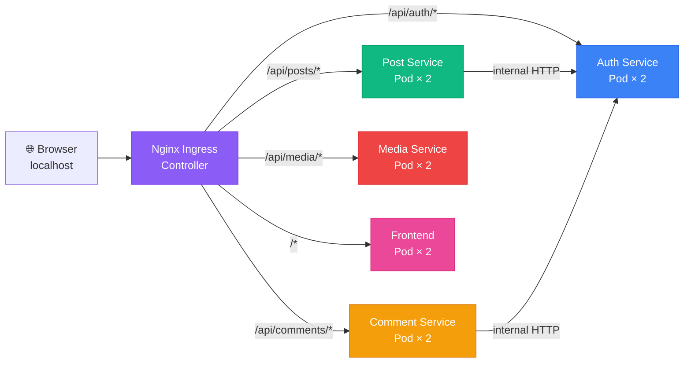

# 🚀 Deploy SocialLite on Local Kubernetes (Docker Desktop)

This guide walks you through deploying all 5 microservices on your local Kubernetes cluster step by step.

## Architecture on Kubernetes



> [!NOTE]
> In Docker Compose, we used an **Nginx gateway container** to route traffic. In Kubernetes, this role is handled by the **Ingress Controller** — a cluster-level component that routes external HTTP traffic to the correct Service based on URL path rules defined in your [ingress.yaml](file:///c:/Users/Akshay/Desktop/development/socisl-media-lite-kubernetes/social-media-microservices/kubernetes/ingress.yaml).

---

## Prerequisites

Make sure you have:
- ✅ **Docker Desktop** installed and running
- ✅ **Kubernetes enabled** in Docker Desktop (Settings → Kubernetes → Enable Kubernetes)
- ✅ **kubectl** available (comes with Docker Desktop)

Verify with:
```powershell
kubectl cluster-info
kubectl config current-context   # Should show: docker-desktop
```

---

## Step 1 — Stop Docker Compose (if running)

If you still have the Docker Compose stack running, stop it first to free port 8080:

```powershell
cd c:\Users\Akshay\Desktop\development\socisl-media-lite-kubernetes\social-media-microservices
docker-compose down
```

---

## Step 2 — Build Docker Images

Since Docker Desktop shares images between Docker and its built-in Kubernetes cluster, you just need to build the images locally. K8s will find them automatically (our manifests use `imagePullPolicy: IfNotPresent`).

Run each command one by one:

```powershell
cd c:\Users\Akshay\Desktop\development\socisl-media-lite-kubernetes\social-media-microservices

docker build -t auth-service:latest ./auth-service
docker build -t post-service:latest ./post-service
docker build -t comment-service:latest ./comment-service
docker build -t media-service:latest ./media-service
docker build -t frontend:latest ./frontend
```

Verify all 5 images exist:
```powershell
docker images | Select-String "auth-service|post-service|comment-service|media-service|frontend"
```

> [!IMPORTANT]
> Every time you change your Python code, you need to rebuild the affected image and then restart the K8s deployment (Step 5 covers how to do rolling restarts).

---

## Step 3 — Install the Nginx Ingress Controller

Kubernetes needs an **Ingress Controller** to handle the routing rules defined in [ingress.yaml](file:///c:/Users/Akshay/Desktop/development/socisl-media-lite-kubernetes/social-media-microservices/kubernetes/ingress.yaml). Without it, your Ingress resource does nothing.

```powershell
kubectl apply -f https://raw.githubusercontent.com/kubernetes/ingress-nginx/controller-v1.12.2/deploy/static/provider/cloud/deploy.yaml
```

Wait for the Ingress Controller to become ready (this may take 1-2 minutes):
```powershell
kubectl -n ingress-nginx get pods --watch
```

You should see something like:
```
NAME                                        READY   STATUS    RESTARTS   AGE
ingress-nginx-controller-xxxxx-xxxxx        1/1     Running   0          60s
```

Press `Ctrl+C` once you see `Running` with `1/1` ready.

> [!NOTE]
> **What is an Ingress Controller?**  
> Think of it as the "Nginx gateway" equivalent from Docker Compose, but managed by Kubernetes. It reads your Ingress resource and automatically configures routing rules. The Nginx Ingress Controller is the most popular one.

---

## Step 4 — Apply All Kubernetes Manifests

Now deploy everything to the cluster. The order matters — ConfigMap and Secrets must exist before Deployments reference them:

```powershell
cd c:\Users\Akshay\Desktop\development\socisl-media-lite-kubernetes\social-media-microservices\kubernetes

# 1. Create ConfigMap (environment variables for inter-service URLs)
kubectl apply -f configmap.yaml

# 2. Create Secrets (JWT secret, DB connection strings)
kubectl apply -f secrets.yaml

# 3. Create ClusterIP Services (internal DNS names for each microservice)
kubectl apply -f services.yaml

# 4. Create Deployments (the actual running Pods for each microservice)
kubectl apply -f auth-deployment.yaml
kubectl apply -f post-deployment.yaml
kubectl apply -f comment-deployment.yaml
kubectl apply -f media-deployment.yaml
kubectl apply -f frontend-deployment.yaml

# 5. Create Ingress (URL routing rules)
kubectl apply -f ingress.yaml
```

> [!TIP]
> You can also apply everything at once with:
> ```powershell
> kubectl apply -f .
> ```
> This applies all `.yaml` files in the `kubernetes/` directory. Kubernetes handles the dependency order automatically.

---

## Step 5 — Verify Everything Is Running

### Check all Pods are Running
```powershell
kubectl get pods
```

Expected output (10 pods total — 2 replicas × 5 services):
```
NAME                                    READY   STATUS    RESTARTS   AGE
auth-deployment-xxxxx-xxxxx             1/1     Running   0          30s
auth-deployment-xxxxx-yyyyy             1/1     Running   0          30s
post-deployment-xxxxx-xxxxx             1/1     Running   0          30s
post-deployment-xxxxx-yyyyy             1/1     Running   0          30s
comment-deployment-xxxxx-xxxxx          1/1     Running   0          30s
comment-deployment-xxxxx-yyyyy          1/1     Running   0          30s
media-deployment-xxxxx-xxxxx            1/1     Running   0          30s
media-deployment-xxxxx-yyyyy            1/1     Running   0          30s
frontend-deployment-xxxxx-xxxxx         1/1     Running   0          30s
frontend-deployment-xxxxx-yyyyy         1/1     Running   0          30s
```

> [!WARNING]
> If any pod shows `CrashLoopBackOff` or `Error`, check its logs:
> ```powershell
> kubectl logs <pod-name>
> ```

### Check all Services
```powershell
kubectl get services
```

### Check Ingress
```powershell
kubectl get ingress
```

---

## Step 6 — Access the Application! 🎉

Open your browser and go to:

### **http://localhost**

That's it! The Nginx Ingress Controller listens on port 80 by default on Docker Desktop.

> [!NOTE]
> If port 80 is already taken by another app, you can check what port the ingress controller is using:
> ```powershell
> kubectl -n ingress-nginx get svc ingress-nginx-controller
> ```
> Look at the `PORT(S)` column — it will show something like `80:31234/TCP, 443:31235/TCP`. Use `http://localhost` (port 80) or the NodePort shown.

---

## 🔧 Common Troubleshooting Commands

Here's a cheat sheet of useful `kubectl` commands:

| What you want to do | Command |
|---|---|
| See all pods | `kubectl get pods` |
| See pod logs | `kubectl logs <pod-name>` |
| Stream live logs | `kubectl logs -f <pod-name>` |
| Describe a pod (events, errors) | `kubectl describe pod <pod-name>` |
| Check services | `kubectl get svc` |
| Check ingress status | `kubectl get ingress` |
| Describe ingress (see routing rules) | `kubectl describe ingress app-ingress` |
| Exec into a pod (like docker exec) | `kubectl exec -it <pod-name> -- /bin/bash` |
| Restart a deployment after code change | `kubectl rollout restart deployment <name>` |
| Scale a deployment | `kubectl scale deployment <name> --replicas=3` |
| Delete everything and start over | `kubectl delete -f .` |
| Watch pods in real-time | `kubectl get pods --watch` |

---

## 🔄 Updating Code (Development Workflow)

When you change your Python code and want to see it in K8s:

```powershell
# 1. Rebuild the changed image (e.g. post-service)
docker build -t post-service:latest ./post-service

# 2. Restart the deployment to pick up the new image
kubectl rollout restart deployment post-deployment

# 3. Watch the rolling update happen
kubectl get pods --watch
```

> [!TIP]
> Kubernetes performs a **rolling update** — it starts new pods with the updated image, waits for them to pass health checks, and then terminates the old pods. Your app stays available during the entire process! This is one of the key benefits of Kubernetes over Docker Compose.

---

## 🧹 Cleanup (Remove Everything)

To tear down the entire deployment:

```powershell
cd c:\Users\Akshay\Desktop\development\socisl-media-lite-kubernetes\social-media-microservices\kubernetes
kubectl delete -f .
```

To also remove the Ingress Controller:
```powershell
kubectl delete -f https://raw.githubusercontent.com/kubernetes/ingress-nginx/controller-v1.12.2/deploy/static/provider/cloud/deploy.yaml
```

---

## 📊 Key Concepts You've Learned

| Docker Compose | Kubernetes Equivalent | Your File |
|---|---|---|
| `services:` in docker-compose.yml | `Deployment` + `Service` | [auth-deployment.yaml](file:///c:/Users/Akshay/Desktop/development/socisl-media-lite-kubernetes/social-media-microservices/kubernetes/auth-deployment.yaml) + [services.yaml](file:///c:/Users/Akshay/Desktop/development/socisl-media-lite-kubernetes/social-media-microservices/kubernetes/services.yaml) |
| `environment:` | `ConfigMap` + `Secret` | [configmap.yaml](file:///c:/Users/Akshay/Desktop/development/socisl-media-lite-kubernetes/social-media-microservices/kubernetes/configmap.yaml) + [secrets.yaml](file:///c:/Users/Akshay/Desktop/development/socisl-media-lite-kubernetes/social-media-microservices/kubernetes/secrets.yaml) |
| Nginx gateway container | `Ingress` + Ingress Controller | [ingress.yaml](file:///c:/Users/Akshay/Desktop/development/socisl-media-lite-kubernetes/social-media-microservices/kubernetes/ingress.yaml) |
| `depends_on:` | Readiness Probes + Service DNS | Health check endpoints in each app |
| `volumes:` | `PersistentVolumeClaim` / `emptyDir` | [media-deployment.yaml](file:///c:/Users/Akshay/Desktop/development/socisl-media-lite-kubernetes/social-media-microservices/kubernetes/media-deployment.yaml) |
| `replicas: 1` (implicit) | `replicas: 2` (configurable) | Each deployment YAML |
| `restart: always` | Built-in (Pods always restart) | Automatic in K8s |
| Service-to-service by container name | Service DNS (`http://auth-service`) | [configmap.yaml](file:///c:/Users/Akshay/Desktop/development/socisl-media-lite-kubernetes/social-media-microservices/kubernetes/configmap.yaml) |
